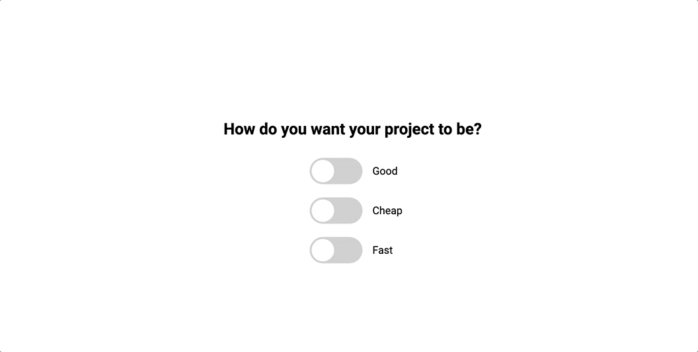

#  ✅⚡💡 Good • Cheap • Fast Checkboxes 

This is a neat **Good Cheap Fast Checkboxes** component built with **HTML**, **CSS**, and **JavaScript**.  
It adds interactive checkboxes labeled “Good”, “Cheap”, and “Fast”—letting the user select only two, with the third being automatically disabled, showcasing the classic project triad constraint. 🎭

---

## 🖼️ Demo 

<p align="center">
  
</p>

---

## 🌟 Features 
-  Only two options selectable at a time (Good, Cheap, Fast)  
-  Third option automatically disabled   
-  Lightweight and user-friendly interactive design   

---

## 🛠️ Technologies Used 
-  HTML  
-  CSS  
-  JavaScript  

---

## 🚀 How to Use 
1. Clone the repository:
   ```bash
   git clone https://github.com/JehanAB/GoodCheapFastCheckboxes.git
